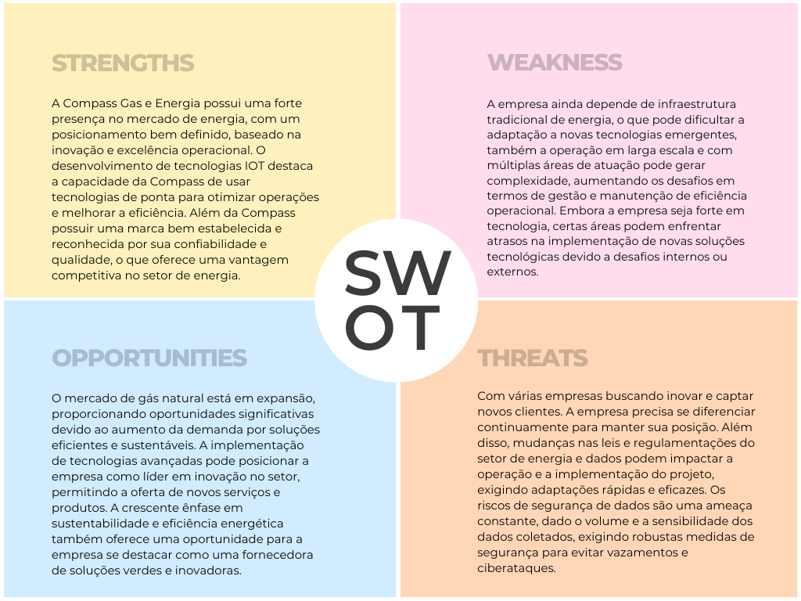
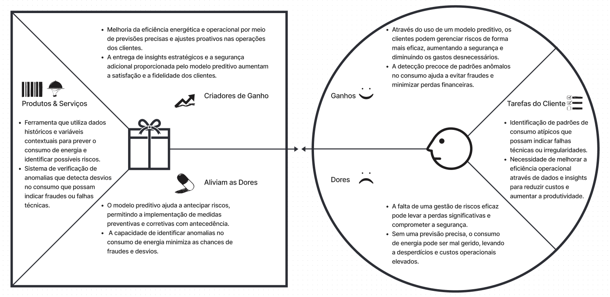
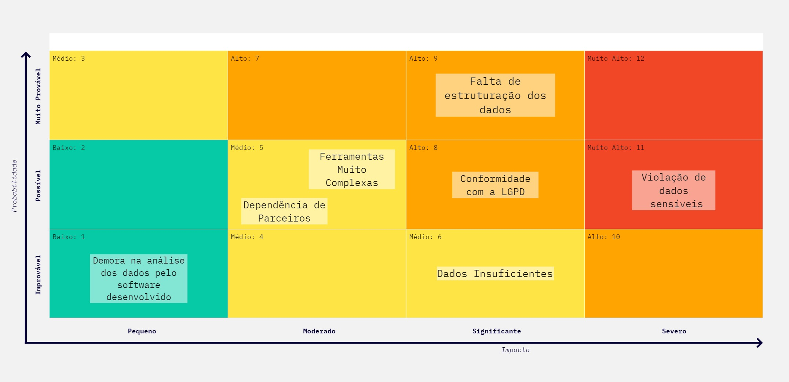
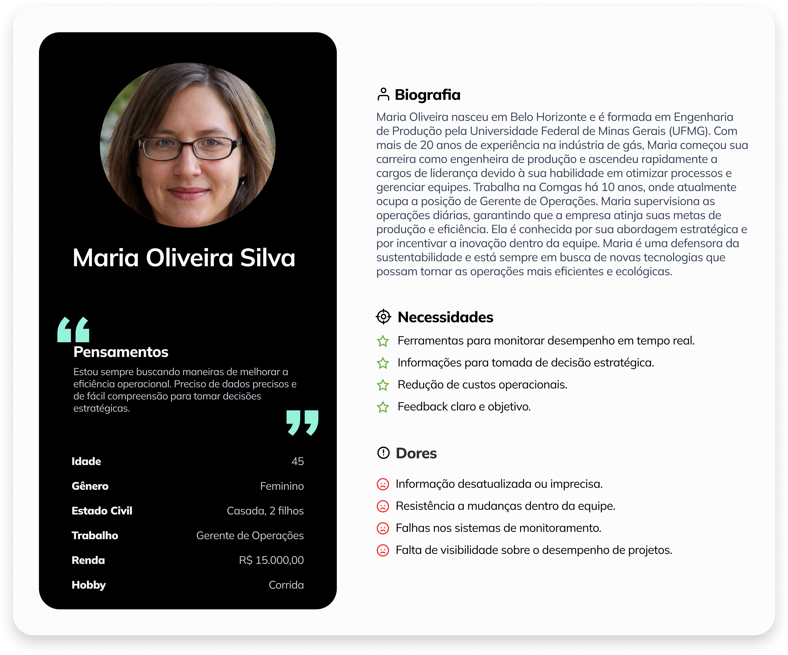

# Documentação Modelo Preditivo - Inteli

```
INSTRUÇÕES GERAIS (remova este trecho ao final)

Você deve editar este documento utilizando notação markdown - siga as convenções neste link 
https://docs.github.com/en/get-started/writing-on-github/getting-started-with-writing-and-formatting-on-github/basic-writing-and-formatting-syntax
```

## AB-Model
### GaSafe
#### Eduardo Fidélis, Fernando Bertholdo, João Preto, Kauã Rodrigues, Leonardo Kalid, Lucas Paiva Brasil, Nicolas Ramon, Vinícius Maciel.

## Sumário
[1. Introdução](#c1)

[2. Objetivos e Justificativa](#c2)

[3. Metodologia](#c3)

[4. Desenvolvimento e Resultados](#c4)

[5. Conclusões e Recomendações](#c5)

[6. Referências](#c6)

[Anexos](#attachments)


## <a name="c1"></a>1. Introdução

&nbsp;&nbsp;&nbsp;&nbsp;A Compass Gás e Energia S.A. é uma holding brasileira de grande porte, reconhecida como uma das líderes no setor energético do país. Com uma ampla rede de distribuição de gás natural, a Compass desempenha um papel essencial na transição energética do Brasil, priorizando a segurança e a eficiência operacional.

&nbsp;&nbsp;&nbsp;&nbsp;Entre os principais ativos da Compass, destaca-se a IOLIT, sua unidade de inteligência de dados. A IOLIT utiliza tecnologias, como o Smart Meter, para coletar e analisar grandes volumes de dados de consumo de gás natural, contribuindo significativamente para a otimização de processos e para a segurança operacional da empresa​.

&nbsp;&nbsp;&nbsp;&nbsp;Entretanto, foi identificada a necessidade de aprimorar a plataforma de inteligência de dados da IOLIT, com o objetivo de enfrentar as dificuldades em detectar anomalias e fraudes no consumo de gás natural de maneira mais eficaz. Essas falhas na detecção não só podem resultar em perdas financeiras significativas, mas também aumentar consideravelmente os riscos operacionais para a empresa. 

## <a name="c2"></a>2. Objetivos e Justificativa
### 2.1 Objetivos

&nbsp;&nbsp;&nbsp;&nbsp;O principal objetivo deste projeto é desenvolver um modelo preditivo para a IOLIT que melhore a gestão de riscos e a segurança, além de identificar novas oportunidades de vendas para serviços de fornecimento de energia. Mais especificamente, detectar anomalias no consumo para aumentar a segurança e a eficiência operacional, assim como identificar e prevenir fraudes. Além disso, busca-se fornecer insights para distribuidores de gás, condomínios e usuários finais, agregando mais valor aos serviços que a empresa já oferece.

### 2.2 Proposta de Solução

&nbsp;&nbsp;&nbsp;&nbsp;A proposta de solução envolve o desenvolvimento de um modelo preditivo para monitorar e analisar o consumo de gás natural dos clientes da Compass Gás e Energia S.A. Utilizando técnicas de aprendizado de máquina, o modelo será treinado com dados históricos para identificar anomalias e padrões de fraude no consumo de gás.

&nbsp;&nbsp;&nbsp;&nbsp;Esse modelo será desenvolvido para processar grandes volumes de dados, identificando padrões de consumo que possam indicar irregularidades. Com a detecção dessas anomalias, a empresa poderá agir com mais agilidade na gestão de riscos e na prevenção de fraudes, o que contribui para uma gestão mais segura dos recursos.

&nbsp;&nbsp;&nbsp;&nbsp;Além de identificar desvios, o modelo também fornecerá previsões do consumo futuro de gás. Isso permitirá à Compass ajustar suas operações e recursos conforme necessário, alinhando-se com os objetivos da empresa.

&nbsp;&nbsp;&nbsp;&nbsp;A capacidade de gerar insights adicionais também é um diferencial do modelo, oferecendo informações úteis para distribuidores de gás, condomínios e usuários finais, agregando valor ao que a Compass já oferece, sem interferir nas demais operações.

### 2.3 Justificativa

&nbsp;&nbsp;&nbsp;&nbsp;A proposta de desenvolver um modelo preditivo para a IOLIT é uma resposta direta à necessidade de melhorar a detecção de anomalias e fraudes no consumo de gás natural. As falhas atuais nesse processo podem gerar perdas financeiras significativas e aumentar os riscos operacionais. Com a aplicação de técnicas de aprendizado de máquina, o modelo permitirá uma análise mais precisa e proativa dos dados de consumo, identificando padrões irregulares de forma mais eficaz.

&nbsp;&nbsp;&nbsp;&nbsp;Além de fortalecer a segurança operacional, o modelo também fornecerá previsões mais confiáveis do consumo futuro de gás, o que é necessário para a otimização da alocação de recursos e para a eficiência das operações. Outro benefício importante é a geração de insights detalhados que podem ser utilizados por distribuidores, condomínios e usuários finais, agregando valor aos serviços que a Compass já oferece.

&nbsp;&nbsp;&nbsp;&nbsp;Essa abordagem se alinha aos objetivos estratégicos da empresa, que incluem a inovação contínua e a busca por soluções que garantam a segurança e a eficiência na gestão dos recursos energéticos. A adoção desse modelo preditivo não só endereça as necessidades atuais da empresa, como também oferece uma base sólida para seu crescimento futuro, mantendo-a competitiva no mercado​.

## <a name="c3"></a>3. Metodologia

&nbsp;&nbsp;&nbsp;&nbsp;Para o desenvolvimento do modelo preditivo no projeto da Compass Gás, adotamos a metodologia CRISP-DM (Cross Industry Standard Process for Data Mining). Essa metodologia, amplamente reconhecida em projetos de ciência de dados, oferece uma estrutura flexível e iterativa, que permite aos integrantes do projeto uma visão clara e organizada do processo de construção de modelos preditivos, desde a fase inicial de compreensão do problema de negócio até a fase final de implantação da solução.

&nbsp;&nbsp;&nbsp;&nbsp;A CRISP-DM foi escolhida por sua capacidade de adaptar-se às necessidades de cada projeto, proporcionando uma abordagem orientada a processos e dividida em seis etapas principais. Cada uma dessas etapas é crítica para o sucesso do modelo preditivo e permite que o ciclo seja revisitado sempre que necessário, garantindo a qualidade e a precisão dos resultados.

&nbsp;&nbsp;&nbsp;&nbsp;**As etapas são descritas da seguinte maneira:**

&nbsp;&nbsp;&nbsp;&nbsp;**Entendimento do Negócio:** Inicia-se o projeto pela compreensão profunda das necessidades da Compass Gás, identificando as principais questões de negócio e definindo os objetivos do modelo preditivo. Nessa fase, além de entender o funcionamento e a dinâmica do setor energético, também são estabelecidos os critérios de sucesso do projeto, como a precisão nas previsões de consumo de gás, visando uma otimização eficiente de recursos.

&nbsp;&nbsp;&nbsp;&nbsp;**Entendimento dos Dados:** Após entender o contexto de negócio, parte-se para o entendimento dos dados. Aqui, analisamos os dados de consumo de gás, como pulseCount, gain, condCode e renda per capita, além de fontes externas que influenciam o consumo, como fatores climáticos e demográficos. Avaliamos a qualidade e completude das informações e, caso necessário, voltamos à etapa anterior para redefinir os critérios com base na disponibilidade dos dados.

&nbsp;&nbsp;&nbsp;&nbsp;**Preparação dos Dados:** Nesta fase, os dados são organizados, limpos e transformados para estarem prontos para a modelagem. Processos como preenchimento de dados faltantes, normalização e criação de variáveis derivadas (como o consumo total de gás) são executados. Aqui, as principais variáveis do modelo são preparadas, garantindo que os dados estejam adequados para gerar insights valiosos para o projeto.

&nbsp;&nbsp;&nbsp;&nbsp;**Modelagem:** Com os dados prontos, iniciamos a construção do modelo preditivo. Algoritmos de machine learning, como regressão linear, Random Forest, e Isolation Forest para detecção de anomalias, são aplicados para prever o consumo de gás com base nos padrões observados. Também realizamos ajustes nos parâmetros para otimizar a performance do modelo.

&nbsp;&nbsp;&nbsp;&nbsp;**Avaliação:** A fase de avaliação permite medir o desempenho do modelo em relação aos objetivos estabelecidos. Utilizamos métricas como erro absoluto médio (MAE) e acurácia para avaliar a precisão das previsões de consumo. Caso o modelo não atenda aos critérios estabelecidos, retornamos às fases de modelagem ou até à preparação dos dados para fazer os ajustes necessários.

&nbsp;&nbsp;&nbsp;&nbsp;**Implantação:** Após a avaliação positiva, o modelo é implementado no ambiente de produção da Compass Gás. A solução preditiva passa a ser utilizada pela empresa para gerar previsões automáticas de consumo, otimizando o planejamento de distribuição e o uso dos recursos energéticos.

&nbsp;&nbsp;&nbsp;&nbsp;O fluxo descrito acima pode ser melhor visualizado na figura abaixo:

<div align="center">
<sub>Figura 1 - Crisp DM</sub>

<sup>Fonte: Material produzido pelos autores (2024)</sup>
</div>

<div align="center">
<sub>Figura 1 - Metologia Crisp DM - Respondida</sub>

<sup>Fonte: Material produzido pelos autores (2024)</sup>
</div>

Mesmo conteúdo da imagem acima para melhor leitura:

**Entendimento do Negócio:**

&nbsp;&nbsp;&nbsp;&nbsp;No projeto Compass Gás, a primeira fase envolve a definição clara dos objetivos, como prever o consumo de gás para melhorar a eficiência na distribuição e estoque. Nessa fase, analisamos as principais demandas de negócio e os desafios enfrentados pela empresa, estabelecendo critérios de sucesso e métricas para avaliar o impacto do modelo preditivo.

**Entendimento dos Dados:**

&nbsp;&nbsp;&nbsp;&nbsp;Nesta etapa, estudamos os dados disponíveis relacionados ao consumo de gás, incluindo variáveis como pulseCount, gain, condCode, e informações externas como clima e renda per capita por CEP. Avaliamos a qualidade, completude e relevância desses dados para o projeto, garantindo que sejam suficientes para gerar insights confiáveis.

**Preparação dos Dados:**

&nbsp;&nbsp;&nbsp;&nbsp;Os dados de consumo e variáveis relacionadas são preparados e transformados para a modelagem. Isso envolve limpeza, preenchimento de dados ausentes, normalização e criação de novas variáveis, como o consumo total de gás (resultado da multiplicação de pulseCount por gain), organizando as informações para garantir que estejam prontas para alimentar os algoritmos preditivos.

**Modelagem:**

&nbsp;&nbsp;&nbsp;&nbsp;Com os dados preparados, iniciamos o processo de criação dos modelos preditivos. Testamos diferentes algoritmos de machine learning, como regressão linear e Random Forest, para prever o consumo de gás com base nas variáveis fornecidas. Algoritmos específicos, como o Isolation Forest, são usados para detectar anomalias de consumo, garantindo a precisão do modelo.

**Avaliação:**

&nbsp;&nbsp;&nbsp;&nbsp;A fase de avaliação permite testar o desempenho do modelo preditivo criado. Usamos métricas como erro absoluto médio (MAE) e acurácia para garantir que o modelo atenda aos critérios de sucesso estabelecidos. Caso necessário, ajustamos o modelo ou voltamos à preparação dos dados para garantir a qualidade das previsões.

**Implantação:**

&nbsp;&nbsp;&nbsp;&nbsp;Após a validação do modelo, ele é implementado na operação da Compass Gás, permitindo que previsões de consumo sejam realizadas em tempo real. A partir dessa fase, o modelo agrega valor ao negócio, otimizando a distribuição de gás e melhorando o planejamento logístico e de estoque.

## <a name="c4"></a>4. Desenvolvimento e Resultados

### 4.1. Compreensão do Problema

&nbsp;&nbsp;&nbsp;&nbsp;Nesta seção, será explorado o problema central do projeto, iniciando com o contexto da indústria de gás e energia, destacando desafios como a detecção de fraudes e a manutenção de operações seguras. Em seguida, serão apresentadas uma análise SWOT e uma matriz de riscos, identificando pontos fortes, fraquezas, oportunidades, ameaças e os principais riscos associados ao problema. Esses elementos servirão de base para o desenvolvimento do modelo preditivo.
### 4.1.1. Contexto da indústria 
&nbsp;&nbsp;&nbsp;&nbsp;A Compass Gás e Energia S.A., uma subsidiária do Grupo Cosan, atua como uma das líderes no setor de gás e energia no Brasil, com foco na distribuição e comercialização de gás natural, energia elétrica, e soluções energéticas integradas. A empresa se destaca pela inovação tecnológica e comprometimento com a sustentabilidade, buscando oferecer soluções eficientes e seguras para seus clientes.

&nbsp;&nbsp;&nbsp;&nbsp;No setor de gás e energia, a detecção de fraudes é um desafio crítico, enfrentado com o uso de modelos preditivos. Empresas como a Petrobras, Gás Brasiliano, Naturgy e Copergás, utilizam tecnologias  para identificar e prevenir fraudes, garantindo a segurança e eficiência das operações. Os modelos de negócio incluem plataformas de monitoramento remoto, sistemas de alerta e consultorias especializadas.

&nbsp;&nbsp;&nbsp;&nbsp;Soluções de leitura de consumo remota e monitoramento em tempo real permitem a detecção rápida de anomalias e fraudes. Modelos preditivos alertam sobre manipulações ilegais do medidor, vazamentos deliberados ou consumo anormal, ajudando a tomar ações preventivas rapidamente. Nesse contexto, a Iolit, uma empresa especializada em soluções tecnológicas para detecção de fraudes, tem uma parceria estratégica com a Compass para o desenvolvimento de soluções personalizadas que utilizam análises e machine learning para identificar comportamentos irregulares.

&nbsp;&nbsp;&nbsp;&nbsp;As tendências neste setor incluem o uso crescente de algoritmos de machine learning e inteligência artificial para prever fraudes com precisão. Essas tecnologias analisam grandes conjuntos de dados e detectam fraudes que métodos tradicionais não captam. A capacidade de analisar dados em tempo real torna possível a rápida detecção de fraudes, permitindo uma resposta eficiente. A implementação de modelos preditivos melhora a segurança e a eficiência operacional, reduzindo perdas financeiras e protegendo essas empresas.

&nbsp;&nbsp;&nbsp;&nbsp;A detecção de fraudes é essencial para a indústria de gás e energia. As empresas, como a Compass, estão investindo em tecnologias preditivas para proteger suas operações e assegurar a confiabilidade e eficiência dos serviços.

**Principais Players, Modelos de Negócio e Tendências**

&nbsp;&nbsp;&nbsp;&nbsp;A indústria de distribuição de gás no Brasil é um setor de grande importância e em amplo crescimento, com vários players de peso e modelos de negócios distintos. A seguir, são destacados alguns pontos desse mercado:

* Principais Players

  - Naturgy: Operando através da CEG e CEG Rio, a Naturgy é um importante player no Rio de Janeiro, fornecendo gás natural a uma vasta gama de consumidores.

  - Copergás: Atuando em Pernambuco, a Copergás é responsável pela distribuição de gás natural no estado, com foco em expandir sua infraestrutura.

  - Gás Brasiliano: Distribui gás natural na região noroeste do estado de São Paulo.

* Modelos de Negócios

  - Distribuição Regional: Muitas empresas operam em concessões regionais, fornecendo gás natural a consumidores residenciais, comerciais e industriais. Elas mantêm e expandem redes de gasodutos para alcançar novos clientes.

  - Gás Natural Liquefeito (GNL): Algumas empresas importam GNL e o processam para distribuição, permitindo que regiões sem infraestrutura de gasodutos recebam gás natural.

  - Parcerias Público-Privadas (PPPs): Algumas distribuidoras operam através de parcerias com o governo, combinando recursos públicos e privados para expandir a infraestrutura de distribuição.

* Tendências

  - Expansão da Infraestrutura: Há um foco contínuo na expansão das redes de gasodutos para alcançar novos mercados e consumidores, especialmente em áreas que atualmente dependem de GLP (gás liquefeito de petróleo).

  - Desregulamentação e Concorrência: O Novo Mercado de Gás, uma iniciativa do governo brasileiro, visa desregulamentar o setor, aumentar a concorrência e reduzir preços. Isso está incentivando novos entrantes e investimentos na infraestrutura.

  - Sustentabilidade e Energia Renovável: Com o aumento da pressão por práticas mais sustentáveis, há um movimento para integrar o uso de gás natural com fontes de energia renovável, bem como melhorar a eficiência energética.

  - Tecnologia e Inovação: A digitalização está transformando o setor, com o uso de tecnologias para monitoramento e gerenciamento de redes, além de melhorar a experiência do cliente através de plataformas digitais.

**5 Forças de Porter**

&nbsp;&nbsp;&nbsp;&nbsp;A análise das Cinco Forças de Porter é uma ferramenta estratégica útil para orientar o desenvolvimento e implementação de um modelo preditivo na Compass Gás e Energia S.A. Este modelo utiliza algoritmos de machine learning e inteligência artificial para detectar fraudes em tempo real, melhorando a segurança e eficiência das operações. Aplicar as Cinco Forças de Porter ajuda a Compass a entender o ambiente competitivo em que o modelo será implementado, identificando fatores que podem influenciar seu sucesso, como o poder de negociação dos fornecedores de tecnologia e a ameaça de novos concorrentes​.
  
  -  Poder de Negociação dos Fornecedores: Moderado

      -  &nbsp;&nbsp;&nbsp;&nbsp;A Compass depende de fornecedores de gás natural, que são limitados e muitas vezes operam em mercados altamente regulados. Como existem poucos fornecedores de gás natural, isso aumenta o poder de negociação deles, pressionando a Compass em termos de preços e condições de fornecimento. No entanto, contratos de longo prazo e regulamentações governamentais podem mitigar um pouco esse poder, além de que a maioria dos contratos são fechados via licitações.
  
  - Poder de Negociação dos Clientes: Moderado

    - &nbsp;&nbsp;&nbsp;&nbsp;Os clientes da Compass incluem consumidores industriais, comerciais, residenciais e até mesmo governos. Enquanto os grandes clientes industriais podem ter mais poder de negociação devido ao volume que consomem, os clientes menores, como residenciais, têm menos poder. A regulação do setor também pode limitar a capacidade dos clientes de negociar preços, mas a existência de alternativas energéticas, como eletricidade ou energias renováveis, pode aumentar o poder de negociação dos clientes.
  
  -  Ameaça de Novos Entrantes: Baixa
    
      - &nbsp;&nbsp;&nbsp;&nbsp;A entrada no mercado de distribuição de gás é extremamente difícil devido às barreiras regulatórias, necessidade de imensos investimentos em infraestrutura, plantas industriais e negociação de contratos extremamente caros. Além disso, o setor é altamente regulado, o que cria obstáculos significativos para novos entrantes. A experiência operacional e a confiança estabelecida da Compass também servem como barreiras para novos competidores.

  - Ameaça de Produtos Substitutos: Moderada
    - &nbsp;&nbsp;&nbsp;&nbsp;Embora o gás natural seja uma fonte de energia importante, existem alternativas, como eletricidade, biogás e outras formas de energia renovável. Com o avanço das tecnologias verdes e a pressão para a descarbonização, a ameaça de substitutos está crescendo. No entanto, a infraestrutura existente para distribuição de gás e as necessidades específicas de alguns consumidores industriais e de condomínios reduzem essa ameaça no curto prazo.
  
  - Rivalidade entre os Competidores: Moderada

    - &nbsp;&nbsp;&nbsp;&nbsp;A rivalidade entre as empresas que operam no setor de distribuição de gás tende a ser moderada, visto que o mercado é primariamente dividido por regiões geográficas. A competição ocorre principalmente em termos de eficiência operacional.

&nbsp;&nbsp;&nbsp;&nbsp;A aplicação das Cinco Forças, propostas por Porter, na análise do modelo preditivo da Compass Gás e Energia S.A. oferece uma compreensão das pressões que podem influenciar o sucesso da solução. Avaliar o ambiente competitivo permite que a Compass se adapte, especialmente em um mercado de distribuição de gás que ainda é pouco digitalizado e está em processo de transformação. Essa realidade torna relevante a implementação de tecnologias  como os modelos preditivos.

#### 4.1.2. Análise SWOT 

&nbsp;&nbsp;&nbsp;&nbsp;A análise SWOT é uma ferramenta de planejamento estratégico que avalia os Pontos Fortes (Strengths), Pontos Fracos (Weaknesses), Oportunidades (Opportunities) e Ameaças (Threats) de uma organização, projeto ou situação. Essa análise ajuda a identificar vantagens competitivas, áreas de melhoria, oportunidades de crescimento no mercado e possíveis ameaças externas, permitindo que a organização desenvolva estratégias mais informadas e eficazes para alcançar seus objetivos.

&nbsp;&nbsp;&nbsp;&nbsp;É importante para uma empresa realizar uma análise SWOT porque ela oferece uma visão abrangente de sua posição no mercado, permitindo identificar e entender suas forças e fraquezas internas, além de mapear as oportunidades e ameaças externas. Com essa clareza, a empresa pode desenvolver estratégias mais eficazes, alavancar suas vantagens competitivas, mitigar riscos, e se adaptar melhor às mudanças no ambiente de negócios, garantindo um planejamento estratégico mais sólido e direcionado para o sucesso a longo prazo.

<div align="center">
<sub>Figura 1 - Analise SWOT</sub>

<sup>Fonte: Material produzido pelos autores (2024)</sup>
</div>

[Link da imagem para melhor visualização](https://drive.google.com/file/d/1zPi1InMwFI3se6fvQG1bjpbKcU0u-ieZ/view?usp=drive_link)

&nbsp;&nbsp;&nbsp;&nbsp;A análise SWOT realizada para a Compass Gás e Energia revela um cenário de grande potencial, impulsionado por inovações tecnológicas e uma equipe experiente, que posicionam a empresa de forma competitiva no mercado de gás. No entanto, a análise também destaca desafios importantes, como a resistência à adoção de novas tecnologias em um setor conservador e os riscos associados à volatilidade do mercado e à infraestrutura necessária. As oportunidades de crescimento, especialmente no contexto de sustentabilidade e eficiência energética, são promissoras, mas exigem da Compass estratégias bem definidas para superar as ameaças externas e maximizar seus pontos fortes. Assim, a empresa deve focar em fortalecer suas bases tecnológicas e educar o mercado sobre os benefícios de suas soluções, garantindo uma posição sólida e sustentável no futuro.


### 4.1.3 Planejamento Geral da Solução

#### Dados Disponíveis 

#### Fonte

Dataset fornecido pela Compass Gás e Energia S.A. Sample dos dados em CSV.

#### Conteúdo

- **clientCode**: Identificador único do cliente (vinculado ao CPF ou CNPJ).
- **clientIndex**: Identificador único para cada instalação realizada.
- **date**: Data de recepção da informação.
- **meterIndex**: Valor da leitura atual do medidor.
- **initialIndex**: Valor inicial do equipamento na instalação.
- **pulseCount**: Valor de pulsos lidos referente ao consumo.
- **gain**: Fator de multiplicação de pulsos para metros cúbicos.
- **rssi**: Intensidade de sinal do sensor ao gateway.
- **gatewayGeoLocation.alt**: Altitude da instalação do gateway.
- **gatewayGeoLocation.lat**: Latitude da instalação do gateway.
- **gatewayGeoLocation.long**: Longitude da instalação do gateway.
- **model**: Modelo do equipamento.
- **serialNumber**: Serial do equipamento.
- **meterSN**: Número do medidor de cada instalação.
- **inputType**: Tipo de leitura do medidor.

#### Solução Proposta

&nbsp;&nbsp;&nbsp;&nbsp;A solução proposta envolve o desenvolvimento de modelos preditivos para detectar anomalias no consumo de gás natural e identificar padrões de fraude. O modelo será treinado para identificar padrões anômalos nos dados de consumo, permitindo uma gestão de riscos mais eficaz e a identificação precoce de fraudes.

#### Tipo de Tarefa

- **Classificação**: Identificação de padrões anômalos que possam indicar fraudes ou desvios no consumo de gás natural.
- **Regressão**: Previsão do consumo futuro de gás com base nos dados históricos e atuais.

#### Utilização da Solução Proposta

&nbsp;&nbsp;&nbsp;&nbsp;A solução será utilizada para monitorar o consumo de gás em tempo real, detectar anomalias que possam indicar fraudes ou falhas nos equipamentos, e fornecer insights para melhorar a eficiência e segurança dos serviços oferecidos pela Compass Gás e Energia S.A.

#### Benefícios Trazidos pela Solução Proposta

- **Melhoria na gestão de riscos**: Detecção de fraudes e desvios no consumo de gás natural.
- **Eficiência operacional**: Insights para otimização de serviços e vendas.
- **Segurança**: Monitoramento em tempo real para rápida resposta a problemas.

#### Critério de Sucesso e Métrica de Avaliação

- **Critério de Sucesso**: Precisão na detecção de anomalias e fraudes no consumo de gás.
- **Métrica**: Acurácia, precisão e recall dos modelos preditivos desenvolvidos.


### 4.1.4. Value Proposition Canvas

&nbsp;&nbsp;&nbsp;&nbsp;O Value Proposition Canvas (VPC) é uma ferramenta estratégica que alinha o valor oferecido por um produto ou serviço às necessidades dos clientes. Ele identifica as tarefas, dores e ganhos dos clientes e relaciona isso com os produtos, aliviadores de dores e geradores de ganhos oferecidos, ajudando a criar uma proposta de valor clara e eficaz.

&nbsp;&nbsp;&nbsp;&nbsp;A seguir, o VPC desenvolvido para o modelo preditivo que será implementado na Compass. A imagem ilustra como o modelo atende diretamente às necessidades e expectativas dos clientes:

<div align="center">
<sub>Figura 2 - Value Proposition Canvas</sub>

<sup>Fonte: Material produzido pelos autores (2024)</sup>
</div>

[Visualizar o Value Proposition Canvas no Figma](https://www.figma.com/board/LZBnsKznUCk8pQtkycQHkX/value_proposition_canvas_draft-ptb?node-id=0-1&t=mVoJVim8zQDU4T0x-1)

&nbsp;&nbsp;&nbsp;&nbsp;O VPC é utilizado no projeto para garantir que o modelo preditivo atenda às necessidades dos clientes da Compass. Ele identifica as tarefas, dores e ganhos dos clientes, orientando o desenvolvimento do modelo para resolver problemas como gestão de riscos e detecção de fraudes, além de criar valor adicional, como novas oportunidades de vendas.

### 4.1.5. Matriz de Riscos

&nbsp;&nbsp;&nbsp;&nbsp;A matriz de risco é importante para o projeto, pois ajuda a identificar e priorizar riscos, permitindo o desenvolvimento de estratégias preventivas. Isso contribui para o sucesso do projeto e protege os recursos, garantindo o cumprimento dos objetivos.

<div align="center">
<sub>Figura 3 - Matriz de Risco</sub>

<sup>Fonte: Material produzido pelos autores (2024)</sup>
</div>

**Descrição dos tópicos da Matriz de Risco:**

**Baixo 1:** Demora na análise dos dados pelo software desenvolvido;

&nbsp;&nbsp;&nbsp;&nbsp;A demora na análise dos dados durante o desenvolvimento do software representa um risco baixo, pois pode comprometer o cronograma do projeto e atrasar a entrega da solução final, porém a chance disso acontecer é baixa e caso aconteça, um professor poderia facilmente ajudar o grupo.

**Médio 5:** Ferramentas muito complexas e Dependência de Parceiros;

&nbsp;&nbsp;&nbsp;&nbsp;Ferramentas muito complexas são um risco médio porque podem atrasar o projeto devido à curva de aprendizado e ao potencial de erros. O treinamento e o suporte técnico são essenciais para superar esses desafios, o que torna o risco gerenciável, mas ainda significativo.

&nbsp;&nbsp;&nbsp;&nbsp;A dependência de parceiros é um risco médio devido a possíveis problemas de coordenação e variação na qualidade dos entregáveis. Embora possa impactar o progresso do projeto, uma comunicação clara e acordos bem definidos ajudam a mitigar esses riscos.

**Médio 6:** Dados Insuficientes;


&nbsp;&nbsp;&nbsp;&nbsp;Dados insuficientes são classificados como um risco médio com probabilidade baixa porque a empresa forneceu dados adequados para o projeto. A disponibilidade desses dados reduz a probabilidade de enfrentar problemas graves relacionados à falta de informações. No entanto, o risco permanece médio, pois, mesmo com dados suficientes, questões como qualidade dos dados ou eventos imprevistos podem ainda impactar a precisão do modelo preditivo.

**Alto 8:** Conformidade com a LGPD;

&nbsp;&nbsp;&nbsp;&nbsp;A conformidade com a LGPD é um risco alto devido à complexidade e rigor dos requisitos legais para proteção de dados pessoais. O não cumprimento pode resultar em sanções legais e danos à reputação da Compass. A necessidade de manter práticas de proteção de dados torna esse risco grande.

**Alto 9:** Falta de estruturação dos dados;

&nbsp;&nbsp;&nbsp;&nbsp;A falta de estruturação dos dados é um risco alto porque dados mal organizados ou desestruturados podem comprometer a eficácia e a precisão do modelo preditivo. Sem uma estrutura adequada, é difícil garantir a qualidade e a integridade dos dados, o que pode levar a análises imprecisas e decisões baseadas em informações incorretas. Além disso, a ausência de estrutura dificulta a integração e a utilização eficiente dos dados, aumentando o tempo e os custos associados ao projeto.

**Muito Alto 11:** Violação de dados sensíveis;

&nbsp;&nbsp;&nbsp;&nbsp;A violação de dados sensíveis é um risco muito alto devido às graves consequências legais e financeiras. Além disso, a exposição de informações pessoais pode abalar a reputação da empresa, resultando em danos à imagem da marca. A combinação dessas consequências torna o risco sério.

### 4.1.6. Personas

&nbsp;&nbsp;&nbsp;&nbsp; As personas são personagens fictícios criados para representar perfis de pessoas reais que interagem com um produto, serviço ou organização. Essas representações são fundamentais para compreender as necessidades, comportamentos e motivações do público-alvo, permitindo que as soluções desenvolvidas sejam mais eficazes e centradas no usuário. No contexto do desenvolvimento de um modelo preditivo para a Compass Gás e Energia S.A., as personas desempenham um importante papel, ajudando a garantir que o modelo atenda às expectativas e necessidades específicas dos seus principais usuários.

#### Usuário do Modelo (Analista de Dados)

A definição da persona do Analista de Dados é essencial para entender o perfil de quem utilizará o modelo preditivo no dia a dia. Esse perfil nos permite identificar as necessidades técnicas e funcionais do usuário, garantindo que o modelo ofereça os recursos adequados para facilitar a análise de dados e a tomada de decisões informadas.

<div align="center">
  <sub>Figura 4 - Formulação de Persona de Usuário do Modelo</sub>
  
  <sup>Fonte: Material produzido pelos autores (2024)</sup>
</div>

**Criação de Persona**

Para a construção da persona "João Silva", foi utilizada uma abordagem que combinou a análise de dados comportamentais de profissionais da área de análise de dados. João, com 28 anos, é um analista de dados dedicado e apaixonado por encontrar padrões e insights em grandes volumes de informação. Com formação em Estatística pela Universidade de São Paulo (USP), ele se destaca por sua capacidade de transformar dados brutos em informações valiosas para a empresa.

As necessidades identificadas para João incluem o acesso rápido e fácil a dados precisos, ferramentas avançadas para análise, a capacidade de personalizar relatórios, uma interface intuitiva, treinamento contínuo em novas tecnologias, e uma colaboração eficiente com outras equipes. Entre suas dores, destacam-se a frustração com dados desatualizados ou incorretos, a falta de integração entre sistemas, interfaces complicadas, e a pressão para entregar resultados rapidamente.

**Análise de Resultados**

A análise dos dados coletados para a construção da persona de João Silva revelou que ele é um profissional altamente técnico, que valoriza a eficiência e a precisão em seu trabalho. Ele é movido pela necessidade de ter ferramentas que o ajudem a realizar análises complexas de forma rápida e eficaz, além de buscar constantemente aprimorar suas habilidades e conhecimentos. Sua frustração com sistemas mal integrados e a pressão por resultados rápidos destacam a importância de desenvolver um modelo preditivo que seja robusto, eficiente e de fácil utilização.

**Formulação Final**

Com base nas necessidades e dores identificadas, foi formulada a persona de João Silva como um usuário que depende fortemente de um modelo preditivo que seja não apenas tecnicamente competente, mas também intuitivo e bem integrado aos sistemas existentes. Esse perfil será fundamental para guiar o desenvolvimento de funcionalidades que atendam às expectativas dos analistas de dados da Compass.

#### Tomador de Decisões (Gerente de Operações)

A persona do Gerente de Operações, representada por Maria Oliveira, é usada para entender o perfil do tomador de decisões dentro da empresa. Como responsável pela supervisão das operações diárias e pela implementação de estratégias de eficiência, Maria precisa de informações claras e precisas para orientar suas decisões estratégicas.

<div align="center">
  <sub>Figura 5 - Formulação de Persona Tomador de Decisão</sub>
  
  <sup>Fonte: Material produzido pelos autores (2024)</sup>
</div>

**Criação de Persona**

A persona "Maria Oliveira" foi desenvolvida com base em entrevistas e na análise do perfil de gerentes de operações na indústria de energia. Maria, com 45 anos e mais de 20 anos de experiência na área, é formada em Engenharia de Produção pela Universidade Federal de Minas Gerais (UFMG). Ela é conhecida por sua abordagem estratégica e por promover a inovação dentro de sua equipe.

Maria necessita de relatórios precisos e fáceis de entender, ferramentas para monitorar o desempenho em tempo real, informações que suportem a tomada de decisões estratégicas, e suporte para a implementação de novas tecnologias. Suas dores incluem a frustração com informações desatualizadas, a falta de integração entre departamentos, resistência a mudanças, problemas de comunicação, e orçamentos restritos.

**Análise de Resultados**

A análise dos dados e das interações com Maria Oliveira revelou que ela é uma líder focada em resultados, que valoriza a clareza e a precisão das informações que utiliza para tomar decisões. Sua preocupação com a eficiência operacional e a sustentabilidade destaca a importância de um modelo preditivo que ofereça não apenas dados confiáveis, mas também insights acionáveis que possam ser facilmente comunicados e implementados em toda a organização.

**Formulação Final**

Com os dados analisados, a persona de Maria Oliveira foi formulada como uma tomadora de decisões que exige um modelo preditivo que seja altamente confiável e intuitivo, capaz de fornecer informações estratégicas de maneira clara e acessível. Essa persona servirá como guia para assegurar que o modelo preditivo desenvolvido seja útil e relevante para os gestores de operações da Compass.

A criação das personas para o projeto de modelo preditivo da Compass Gás e Energia S.A. é essencial para garantir que a solução desenvolvida seja eficaz e relevante para os principais usuários. Compreender as necessidades, desafios e motivações de perfis como o Analista de Dados e o Gerente de Operações permite direcionar o desenvolvimento do modelo de forma alinhada às expectativas desses profissionais, assegurando que o produto final seja intuitivo, funcional e capaz de otimizar processos e decisões estratégicas dentro da empresa. Assim, o uso de personas não só enriquece o processo de design, mas também fortalece a capacidade do modelo preditivo de gerar valor real para a organização.

### 4.1.7. Jornadas do Usuário

**Introdução à Jornada do Usuário**

&nbsp;&nbsp;&nbsp;&nbsp;A jornada do usuário é uma ferramenta essencial no processo de design centrado no usuário, pois nos permite mapear e entender como os diferentes usuários interagem com um produto ou serviço ao longo do tempo. Este mapeamento nos ajuda a identificar os principais pontos de contato, as necessidades específicas de cada perfil de usuário, as emoções envolvidas em cada etapa, além das oportunidades e barreiras que podem surgir ao longo do processo. Ao documentar a jornada do usuário, podemos criar soluções mais eficazes e alinhadas às expectativas dos nossos usuários, garantindo uma melhor experiência e um maior sucesso na implementação das soluções.

**Jornada do Usuário - João (Analista de Dados)**

&nbsp;&nbsp;&nbsp;&nbsp;Antes de apresentar a jornada do usuário, vamos relembrar um pouco sobre quem é a nossa persona João:

<div align="center">
  <sub>Figura 6 - Formulação de Persona de Usuário do Modelo</sub>
  
  <sup>Fonte: Material produzido pelos autores (2024)</sup>
</div>

&nbsp;&nbsp;&nbsp;&nbsp;João Silva é um analista de dados altamente técnico, com uma forte paixão por identificar padrões e extrair insights de grandes volumes de informação. Trabalhando em uma grande empresa de energia, ele se depara diariamente com ferramentas de análise que não atendem às suas expectativas de eficiência e precisão. João sente a pressão constante para entregar resultados rápidos e precisos, mas as limitações das ferramentas atuais geram frustração e dificultam seu trabalho. Sua jornada com a nova ferramenta de análise preditiva começou com a frustração em relação às soluções existentes e culminou em uma crescente satisfação à medida que ele se adaptava à nova ferramenta e via os resultados se manifestarem.

<div align="center">
  <sub>Figura 7 - Formulação de Persona Tomador de Decisão</sub>
  
  <sup>Fonte: Material produzido pelos autores (2024)</sup>
</div>

&nbsp;&nbsp;&nbsp;&nbsp;João valoriza muito a precisão dos dados e a capacidade de personalizar suas análises para atender às necessidades específicas da empresa. Ele espera que a nova ferramenta de análise preditiva seja intuitiva, integrada e capaz de melhorar significativamente sua produtividade e a qualidade dos insights que ele pode oferecer. Ao longo de sua jornada, João passou por várias etapas emocionais, desde a frustração inicial até a satisfação com o uso contínuo da ferramenta, e finalmente, o orgulho pelos resultados alcançados.

**Expectativas:**

&nbsp;&nbsp;&nbsp;&nbsp;João espera que a nova ferramenta de análise preditiva seja intuitiva, rápida e integrada aos sistemas existentes, permitindo a personalização de relatórios e a detecção precisa de anomalias e fraudes. Ele quer reduzir o tempo que gasta tentando adaptar ferramentas inadequadas e concentrar seus esforços em extrair insights valiosos que realmente impactem o negócio. Além disso, João espera que a nova solução lhe permita melhorar suas habilidades e trabalhar de forma mais colaborativa com outras equipes, contribuindo significativamente para o sucesso da empresa.


**Jornada do Usuário - Maria Oliveira (Gerente de Operações)**

&nbsp;&nbsp;&nbsp;&nbsp; Antes de apresentar a jornada do usuário, vamos relembrar um pouco sobre quem é a nossa persona Maria:

<div align="center">
  <sub>Figura 8 - Formulação de Persona Tomador de Decisão</sub>
  
  <sup>Fonte: Material produzido pelos autores (2024)</sup>
</div>

&nbsp;&nbsp;&nbsp;&nbsp;Maria Oliveira é a Gerente de Operações de uma grande empresa do setor de gás, com a responsabilidade de supervisionar e otimizar os processos diários para garantir que a empresa atinja suas metas de produção e eficiência. Com uma abordagem estratégica, Maria busca sempre a inovação e a sustentabilidade nas operações, mas enfrenta desafios constantes com a falta de informações atualizadas e a falta de integração entre os diferentes sistemas utilizados pela empresa. 

<div align="center">
  <sub>Figura 9 - Formulação de Persona Tomador de Decisão</sub>
  
  <sup>Fonte: Material produzido pelos autores (2024)</sup>
</div>

&nbsp;&nbsp;&nbsp;&nbsp;Sua jornada com a nova solução de monitoramento e análise de dados reflete uma preocupação constante com a precisão e clareza das informações necessárias para tomar decisões estratégicas. Maria passou por uma jornada que incluiu a pesquisa minuciosa de soluções, avaliação cuidadosa e, finalmente, a implementação e uso contínuo da ferramenta. Durante essa jornada, Maria demonstrou uma série de emoções que variam desde a preocupação inicial até a gratificação ao observar os impactos positivos da nova ferramenta nas operações.

&nbsp;&nbsp;&nbsp;&nbsp;Maria valoriza a clareza e a precisão das informações e espera que a nova solução não apenas melhore a eficiência operacional, mas também facilite a integração entre as equipes e promova uma cultura de inovação contínua. Ela vê na nova ferramenta uma oportunidade de garantir que as operações da empresa sejam mais eficientes e sustentáveis, permitindo que a empresa se mantenha competitiva no longo prazo.

**Expectativas:**

&nbsp;&nbsp;&nbsp;&nbsp;Maria espera que a nova solução de monitoramento e análise de dados forneça relatórios claros, precisos e em tempo real, que possam ser facilmente compreendidos e utilizados para melhorar a eficiência operacional e a tomada de decisões estratégicas. Ela também espera que a solução ajude a integrar melhor as diferentes partes da operação, facilitando a comunicação entre as equipes e promovendo uma cultura de inovação. Além disso, Maria quer que a nova ferramenta permita a identificação rápida de problemas e oportunidades, ajudando a garantir que a empresa permaneça competitiva e sustentável no longo prazo.

**Processo de Construção das Jornadas**

&nbsp;&nbsp;&nbsp;&nbsp;As jornadas de João Silva e Maria Oliveira foram desenvolvidas através de uma análise detalhada de suas necessidades, emoções, oportunidades e barreiras em cada estágio do processo de interação com a ferramenta. A construção dessas jornadas envolveu a criação de personas baseadas em dados reais e entrevistas, garantindo que cada ponto de contato fosse cuidadosamente mapeado para refletir a experiência do usuário de forma precisa.

&nbsp;&nbsp;&nbsp;&nbsp;Essa abordagem nos permitiu não apenas entender os desafios que esses usuários enfrentam, mas também identificar oportunidades para melhorar suas experiências com as nossas soluções. Ao documentar essas jornadas, criamos um guia valioso para o desenvolvimento de produtos e serviços que realmente atendam às expectativas dos nossos usuários, garantindo um maior sucesso na implementação e utilização das nossas ferramentas.

Link do documento oficial com a jornada do usuário:
https://www.canva.com/design/DAGPEtdkkyg/OzS2gjKWI6Yfb-O-ACT0dw/edit?utm_content=DAGPEtdkkyg&utm_campaign=designshare&utm_medium=link2&utm_source=sharebutton


### 4.1.8 Política de Privacidade

[Clique para acessar a Política de Privacidade](https://drive.google.com/file/d/19vRBfdZ6urTdNFFIrkVh1ighMVgykdSd/view?usp=sharing)

A adaptação e desenvolvimento da Política de Privacidade da Compass para o projeto de modelo preditivo foi uma etapa fundamental para assegurar a conformidade com a Lei Geral de Proteção de Dados Pessoais (LGPD) e refletir as especificidades do setor em que a empresa atua. Este projeto, que envolve soluções tecnológicas avançadas no setor de Óleo e Gás, utiliza dispositivos Compass (Internet das Coisas) para monitoramento remoto de consumo de gás, coletando e processando dados que são essenciais para a operação e para a inovação que a Iolit traz ao mercado.

A Política de Privacidade foi elaborada para abranger todos os aspectos do tratamento de dados necessários para o funcionamento dos dispositivos Smart Meter, que capturam uma vasta gama de informações, desde dados básicos de consumo até alertas sobre condições operacionais críticas, como vazamentos e fraudes. Além disso, a coleta de dados de localização e preferências dos usuários permite que a Compass personalize a experiência e melhore continuamente os serviços oferecidos.

Um dos pontos mais críticos e inovadores deste projeto é a utilização dos dados coletados para alimentar e aprimorar modelos preditivos. Esses modelos são desenvolvidos para antecipar problemas, otimizar a manutenção e oferecer insights estratégicos visando transformar a gestão operacional de empresas de distribuição de gás. Por isso, a Política de Privacidade foi ajustada para incluir cláusulas que detalham o uso desses dados para fins de modelagem preditiva, garantindo transparência e clareza sobre como essas informações serão utilizadas.

A necessidade de adequação à LGPD não se trata apenas de uma exigência legal, mas também de um compromisso com a segurança e a confiança dos clientes e parceiros. A conformidade com a LGPD assegura que a Compass adota as melhores práticas nacionais e internacionais em termos de proteção de dados, incluindo medidas de segurança robustas, como criptografia e monitoramento contínuo, que são essenciais para proteger as informações coletadas contra acessos não autorizados e outras ameaças.

Além disso, a adaptação da política reflete a responsabilidade da Compass em garantir que todas as operações que envolvem dados pessoais sejam realizadas de forma transparente e segura. A inclusão de orientações claras sobre os direitos dos usuários e a forma como eles podem exercer esses direitos é fundamental para manter a confiança e o relacionamento sólido com os stakeholders.

Por fim, a elaboração desta Política de Privacidade ajustada e específica para o projeto reafirma o compromisso da Compass com a inovação responsável, alinhando o uso de tecnologia de ponta com o respeito à privacidade e a proteção dos dados pessoais. Essa abordagem não só garante a conformidade legal, mas também fortalece a reputação da Iolit como uma empresa que valoriza e protege as informações de seus clientes enquanto continua a liderar com soluções tecnológicas no setor de Óleo e Gás.


### 4.2. Compreensão dos Dados

&nbsp;&nbsp;&nbsp;&nbsp;Nesta seção, será apresentada uma análise detalhada das características das variáveis que compõem o conjunto de dados. O objetivo é identificar as principais tendências, padrões e possíveis inconsistências, facilitando o entendimento do comportamento dos dados. Esta análise é precisa para direcionar as etapas subsequentes do desenvolvimento do modelo preditivo.

### 4.2.1. Exploração de dados

Disponível em notebook.

### 4.2.2. Pré-processamento dos dados

Disponível em notebook.

### 4.2.3. Hipóteses

Disponível em notebook.

### 4.3. Preparação dos Dados e Modelagem

Disponível em notebook.

### 4.4. Comparação de Modelos

Disponível em notebook.

### 4.5. Avaliação

**Solução do Modelo Preditivo e Justificativa da Escolha**

O modelo preditivo selecionado para implementação é o **Modelo 1**, que utiliza o algoritmo de clustering **K-Means** para detectar padrões de consumo e identificar anomalias no uso de gás natural. Esse modelo atende de maneira robusta às necessidades descritas na Seção 4.1, que envolve o entendimento do negócio e das personas, focando nas demandas operacionais da **persona Maria Oliveira**, gerente de operações da Compass Gás e Energia S.A., e seu interesse em garantir monitoramento contínuo, segurança e eficiência no controle do consumo de gás pelos clientes.

O **Modelo 1** foi escolhido por suas capacidades de agrupar clientes com perfis de consumo semelhantes, o que facilita a detecção de variações anômalas no comportamento de consumo. Isso é fundamental para oferecer à Maria Oliveira uma visão clara e objetiva sobre o uso de gás por seus clientes, permitindo o acompanhamento de padrões fora do esperado e apoiando a tomada de decisões estratégicas. Além disso, o cálculo de consumo médio entre as medições elimina picos falsos gerados por problemas nos contadores de pulsos, proporcionando uma visão mais precisa dos dados.

Essa abordagem também contribui para a segurança operacional, uma vez que possibilita a identificação de possíveis anomalias que podem estar relacionadas a falhas no sistema de medição ou variações inesperadas de consumo. 

### Justificativa Alinhada com as Necessidades do Negócio

Conforme discutido na Seção 4.1, o principal objetivo da Compass é garantir um fornecimento de gás seguro e eficiente para seus clientes, além de oferecer um serviço confiável. O **Modelo 1** se alinha a esses objetivos ao fornecer:

- **Agrupamento de clientes com padrões de consumo semelhantes** por meio do **K-Means**, facilitando a identificação de desvios no comportamento de clientes específicos;
- **Detecção de picos falsos** por meio da média entre medições, evitando alarmes incorretos e garantindo que os dados representem de forma precisa o consumo real de gás.

Além disso, o modelo foi testado com diferentes números de clusters para garantir a melhor segmentação dos clientes. O método **Elbow** foi aplicado para determinar o número ideal de clusters, e o resultado sugeriu 3-4 clusters como a configuração mais adequada para identificar padrões diferenciados de consumo.

### Comparativo com Alternativas

- **Modelo 2 (Análise de consumos negativos com clusterização)**: Apesar de útil em cenários específicos, esse modelo se mostrou limitado em sua aplicação mais ampla, uma vez que foca em eventos raros de consumos negativos, o que não atende de forma completa à necessidade de um monitoramento contínuo.
  
- **Modelo 3 (Análise de consumo em dias específicos)**: Este modelo se concentra em comparar o consumo diário com a média do condomínio, mas não oferece a granularidade necessária para uma detecção eficaz de anomalias ao longo do tempo, sendo mais adequado para análises pontuais.

O **Modelo 1** demonstrou maior consistência e abrangência ao lidar com variações temporais e comportamentais, o que o torna a solução mais eficaz para as necessidades operacionais e de monitoramento da Compass.

### Plano de Contingência

Para garantir que o modelo continue a oferecer resultados precisos, mesmo em caso de falhas ou variações inesperadas, o seguinte plano de contingência será implementado:

1. **Revisão dos Dados**: Se ocorrerem inconsistências nos resultados, será feita uma revisão detalhada dos dados de entrada, verificando se há lacunas, erros de medição ou valores discrepantes que possam ter comprometido as predições. Caso necessário, os dados serão ajustados para garantir sua integridade.

2. **Ajuste dos Parâmetros do K-Means**: O número de clusters poderá ser revisado caso o padrão de consumo dos clientes mude significativamente ao longo do tempo. Isso permitirá que o modelo se adapte a novas condições operacionais e comportamentais.

3. **Verificação Manual dos Resultados**: Em situações críticas, a equipe de operações da Compass realizará uma verificação manual dos dados gerados pelo modelo. Isso assegura que anomalias identificadas sejam avaliadas corretamente e que não sejam gerados alertas falsos.

## <a name="c5"></a>5. Conclusões e Recomendações
A implementação do **Modelo 1** trouxe uma visão clara dos padrões de consumo de gás natural, permitindo a detecção de anomalias e um monitoramento eficaz. Essa abordagem atende diretamente às necessidades da **Compass Gás e Energia S.A.**, pois oferece um acompanhamento contínuo do consumo e ajuda a identificar rapidamente qualquer irregularidade.

### Recomendações

Para maximizar os benefícios do modelo, é preciso estabelecer um monitoramento contínuo dos resultados. Isso permitirá que a equipe avalie a precisão do modelo ao longo do tempo e faça os ajustes necessários, garantindo que ele se mantenha alinhado com as mudanças nos padrões de consumo.

Outra sugestão é a ampliação do uso do modelo. Além de monitorar o consumo em condomínios, há uma oportunidade para aplicá-lo em outras áreas, como na distribuição de gás em redes maiores ou contextos industriais. Essa expansão pode trazer ganhos operacionais e aumentar a segurança do fornecimento, fortalecendo ainda mais o papel do modelo na gestão do consumo.

### Próximos Passos

Por fim, é importante criar um ciclo regular de avaliação do modelo, onde aspectos como a taxa de detecção de anomalias e a ocorrência de falsos positivos sejam revisados periodicamente. Essa prática não só garantirá que o modelo continue a trazer resultados positivos, mas também permitirá que a Compass se adapte às mudanças e otimize o uso de seus recursos, sempre em busca de uma operação mais eficiente e segura.

## <a name="c6"></a>6. Referências

**ROCK CONTENT.** As 5 forças de Porter: o que é, importância e exemplos práticos. 2023. Disponível em: https://rockcontent.com/br/blog/5-forcas-de-porter/. Acesso em: 15 ago. 2024.


**COMPASS.** Sobre nós. 2024. Disponível em: https://www.compassbr.com/en/about-compass/about-us/. Acesso em: 09 ago. 2024.

**IOLIT.** Home. 2024. Disponível em: https://www.iolit.com.br/. Acesso em: 09 ago. 2024.

**COMMIT GÁS.** About Compass Gas & Energy. 2024. Disponível em: https://www.commitgas.com/about-compass-gas-and-energy/compass-gas-and-energy/. Acesso em: 09 ago. 2024.

**URBAN COMPANY** Como é morar no Moinhos de Vento, bairro de alto padrão de Porto Alegre? 2024. Disponível em: https://www.urban.imb.br/blog/dicas-sobre-investimentos-imobiliarios/como-e-morar-no-moinhos-de-vento-bairro-de-alto-padrao-de-porto-alegre/. Acesso em: 27 ago. 2024. 

## <a name="attachments"></a>Anexos
```
Utilize esta seção para anexar materiais como manuais de usuário, 
documentos complementares que ficaram grandes e não couberam no 
corpo do texto etc.

Remova este bloco ao final
```
